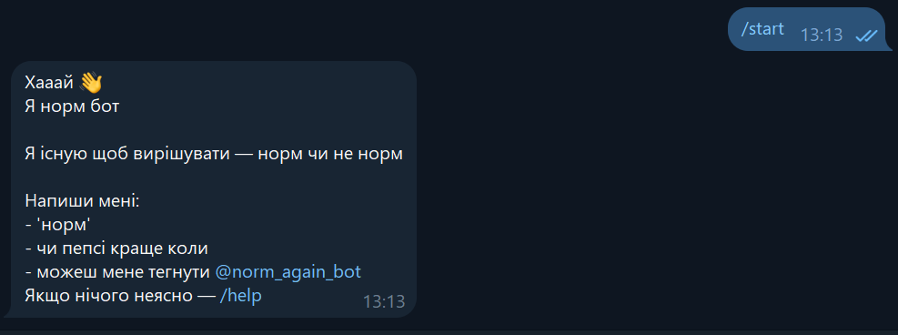
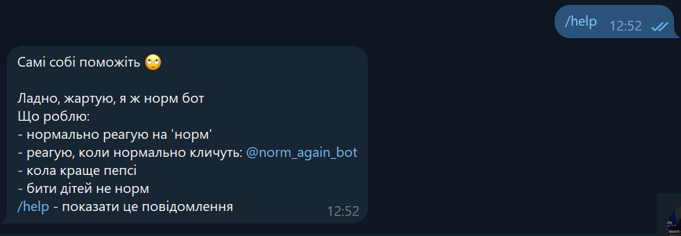
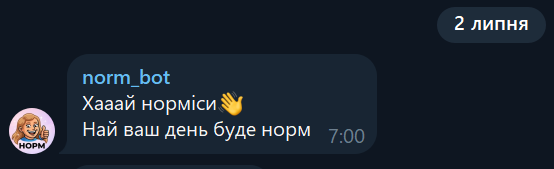
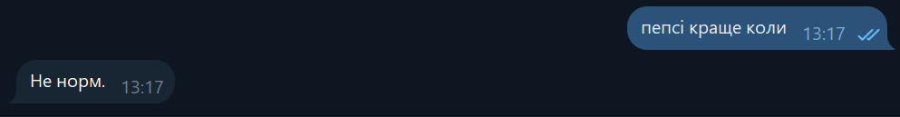

# Norm Bot

Telegram-бот, який оцінює "Норм" чи "Не норм".

## Можливості

- випадкові відповіді на слово "норм"
- реакція на згадку @norm_again_bot
- команди:
  - /start
  - /help
  - /pause
  - /play
  - /morning_on
  - /morning_off
- автоматичне ранкове повідомлення (на павзі)
- Pepsi vs Coca-Cola
- реакція на токсичні фрази
- відповіді на подяку

## Технології

- Python 3.13
- python-telegram-bot
- Render
- Telegram Bot API

## Screenshots

| /start | /help |
|--------|--------|
|  |  |

| Morning greeting | Pepsi vs Coca-Cola |
|------------------|--------------------|
|  |  |

## Запуск

```bash
git clone https://github.com/alarmmclockk-eleonora-BR/norm-bot.git

cd norm-bot

pip install -r requirements.txt

export TOKEN=YOUR_TOKEN

python bot.py
```

## Автор

Елеонора Буднік
